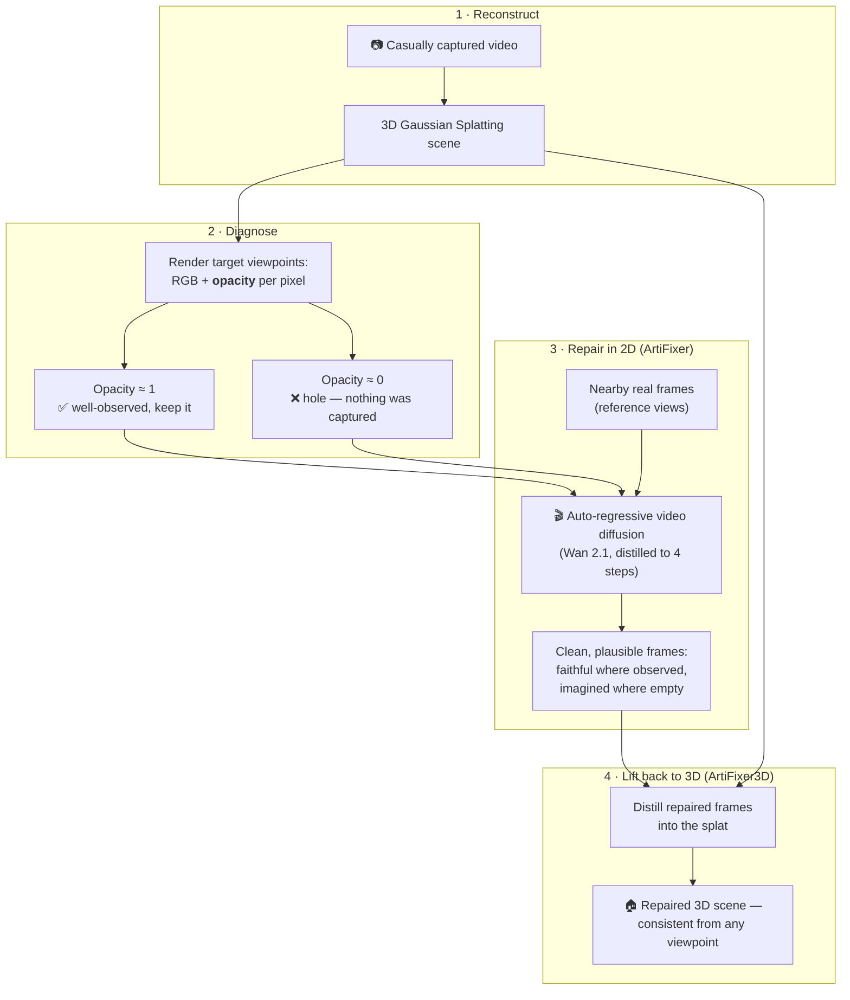
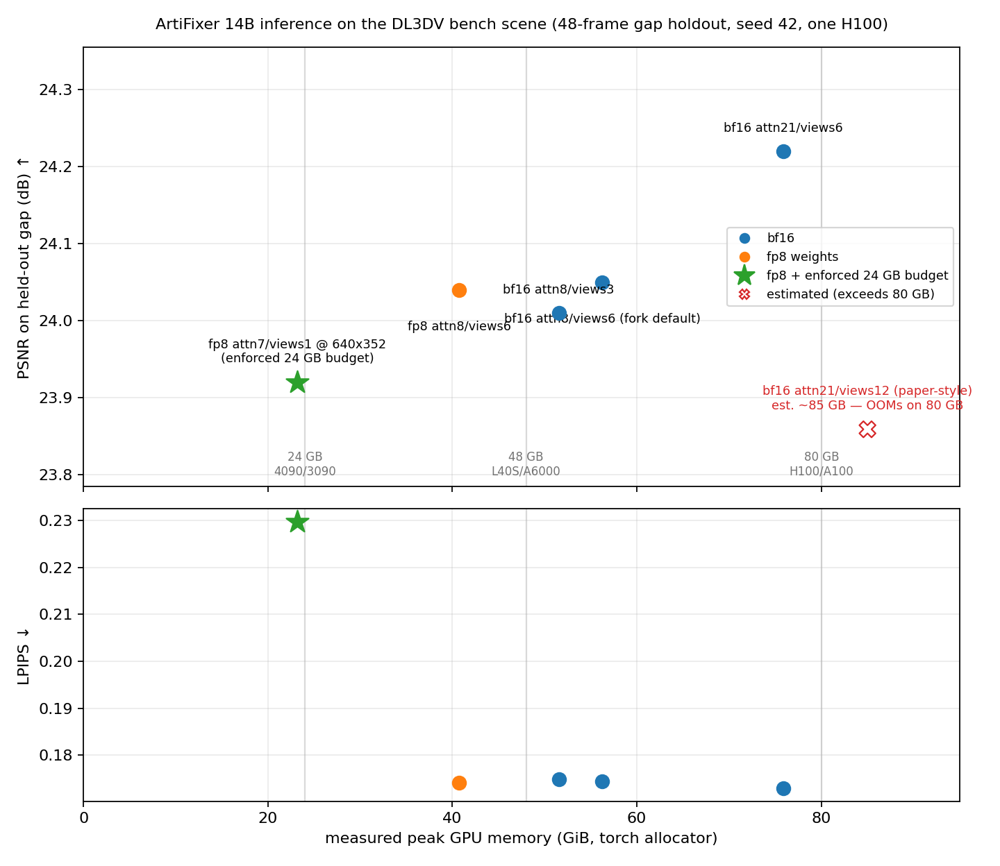

<!-- SPDX-FileCopyrightText: Copyright (c) 2026 NVIDIA CORPORATION & AFFILIATES. All rights reserved. -->
<!-- SPDX-License-Identifier: Apache-2.0 -->

# ArtiFixer: Enhancing and Extending 3D Reconstruction with Auto-Regressive Diffusion Models

[Riccardo de Lutio](https://riccardodelutio.github.io/),
[Tobias Fischer](https://tobiasfshr.github.io/),
[Yen-Yu Chang](https://yuyuchang.github.io/),
[Yuxuan Zhang](https://scholar.google.com/citations?user=Jt5VvNgAAAAJ&hl=en),
[Jay Zhangjie Wu](https://zhangjiewu.github.io/),
[Xuanchi Ren](https://xuanchiren.com/),
[Tianchang Shen](https://www.cs.toronto.edu/~shenti11/),
[Katarina Tothova](https://www.linkedin.com/in/katarina-tothova/),
[Zan Gojcic](https://zgojcic.github.io/),
[Haithem Turki](https://haithemturki.com/)

[Project Page](https://research.nvidia.com/labs/sil/projects/artifixer/) / [Paper](https://research.nvidia.com/labs/sil/projects/artifixer/assets/paper.pdf)


This repository provides the official implementation of ArtiFixer.

## How ArtiFixer Works (at a glance)

3D reconstructions (e.g. Gaussian Splatting) look great from viewpoints close
to the capture trajectory — but step off that path and under-observed regions
show up as holes, floaters, and smearing, because no camera ever saw them.
ArtiFixer repairs exactly those regions with a video diffusion prior, then
bakes the repairs back into the 3D scene:



**The key idea — opacity mixing.** The renderer's own accumulated opacity is
a free, per-pixel confidence map: it is high where the capture actually
observed geometry and near zero inside holes. ArtiFixer conditions the
diffusion model on both the rendered RGB *and* this opacity, so the model
learns to **preserve** the reconstruction where it is trustworthy and to
**generate** plausible content only where the reconstruction has nothing —
smoothly interpolating between the two. Nearby real frames are attended to as
references so the hallucinated content stays consistent with the scene.

**Why the video model matters.** Fixing each frame independently produces
plausible but *inconsistent* images (each frame invents a slightly different
world). ArtiFixer generates frames auto-regressively along the camera path —
each new frame attends to the previously repaired ones — and the final
ArtiFixer3D distillation enforces full multi-view consistency, which is what
turns per-frame repairs into an actual 3D improvement.

## Benchmarks on a Single GPU (this fork)

The paper's protocol (full attention window, 12 reference views) was run on
GB300-class GPUs and **does not fit an 80 GB H100**: at ~1.3 MP the KV cache
alone is ~53 GB and the reference-view cross-attention cache another ~32 GB on
top of 28 GB of bf16 weights. This fork's default settings
(`--local_attn_size 8 --num_views 6`, deterministic seeding) bring the whole
pipeline to **one H100** with no model changes. Numbers below are measured on
a single 80 GB H100 (PCIe) with `artifixer:cuda12`.

### Quality (public scenes, contiguous-gap holdout)

A contiguous block of frames is held out to create a genuinely under-observed
region (the off-trajectory setting ArtiFixer targets), the base 3DGRUT splat
is trained on the rest, and the held-out frames are evaluated against GT.

| scene | held out | arm | PSNR ↑ | SSIM ↑ | LPIPS ↓ |
|---|---|---|---|---|---|
| DL3DV `032dee9f…` (walking, 319 frames @ 960×528) | 48 frames | base splat | 19.61 | 0.724 | 0.177 |
| | | **ArtiFixer3D** | **23.20** (+3.59) | **0.776** | **0.118** |
| Mip-NeRF 360 `garden` (orbit, 185 frames @ 1104×720) | 28 frames | base splat | 27.58 | 0.850 | 0.135 |
| | | **ArtiFixer3D** | **27.90** (+0.33) | **0.854** | **0.130** |

Two properties worth noting:

- **Gains scale with the reconstruction deficit.** The DL3DV walking capture
  leaves the held-out region genuinely under-observed (worst view collapses to
  ~15 dB of floaters and smearing) and ArtiFixer recovers it (+3.59 dB). The
  garden orbit keeps the held-out region well covered by neighboring views, so
  there is little to repair.
- **A good reconstruction is not harmed.** On garden the refined scene is
  slightly *better* than the base everywhere we measured — the opacity-mixing
  conditioning preserves well-observed content.

### Wall-clock and memory (one H100, end to end)

| stage | DL3DV (0.5 MP) | garden (0.8 MP) |
|---|---|---|
| prepare (includes 10k-step base 3DGRUT training) | 22m43s | 22m23s |
| ArtiFixer inference (14B, 4-step, auto-regressive) | 4m22s | 4m02s |
| ArtiFixer3D distill (30k steps) | 25m03s | 16m42s |
| **total** | **52 min** | **43 min** |
| peak GPU memory (inference) | 58.7 GB | 73.6 GB |

The quality table above was measured before the reference-view fix (the
KV-cache inference path used to silently ignore `--num_views` neighbor images
on single-GPU runs — see `model_training/pipeline/kv_cache_pipeline.py`).
Re-measured after the fix, the direct 2D output on the DL3DV scene moves by
less than 0.05 dB / 0.001 LPIPS, so the table stands; the decision matrix
below uses post-fix numbers throughout. Peak-memory numbers in this table are
`nvidia-smi` process totals; the matrix below reports the (slightly lower)
torch-allocator peaks that `run_inference` now prints at the end of each run.

If you already have a trained 3DGRUT splat, pass it via
`--reconstruction_checkpoint` and the prepare stage drops to minutes (renders
and captions only).

### What GPU do I need?

Pick your row. Every configuration below is measured end to end on the same
DL3DV benchmark scene (960×528 unless stated, 48-frame contiguous-gap holdout,
seed 42), so quality, memory, and time are directly comparable. Quality is
PSNR↑ / SSIM↑ / LPIPS↓ of the ArtiFixer 2D output against GT on the held-out
gap, computed with `model_eval.metrics_utils` (LPIPS-VGG) — the base splat
scores 19.61 / 0.737 / 0.235 on this stack. SSIM/LPIPS are therefore not
comparable with the quality table above, which used a different SSIM/LPIPS
implementation; PSNR is implementation-independent and matches. Time is the
full `run_inference` wall clock, including ~1.5 min of checkpoint load.

| GPU class | flags | max input | quality (gap) | measured peak | time |
|---|---|---|---|---|---|
| 80 GB (H100/A100-80G) | defaults (bf16, `--local_attn_size 8 --num_views 6`) | ~0.8 MP (≈3,200 tokens) | 24.05 / 0.759 / 0.174 | 56.3 GiB | 3m55s |
| 48 GB (L40S/A6000) | `--transformer_quantization fp8` (same attention) | ~0.5 MP (≈2,300 tokens) | 24.04 / 0.759 / 0.174 | 40.7 GiB | 3m51s |
| 24 GB (RTX 4090/3090) | `--transformer_quantization fp8 --local_attn_size 7 --num_views 1` | ≤640×352 (≈880 tokens) | 23.92 / 0.750 / 0.230* | 23.2 GiB alloc / 23.6 GiB reserved | 2m10s |

*Measured against the same full-resolution GT (prediction upsampled from
640×352), so the resolution loss is included; at its native 640×352 the same
output scores 23.91 / 0.765 / 0.142.

Notes:

- **fp8 is quality-free at matched settings.** `--transformer_quantization
  fp8` stores every transformer-block linear as `float8_e4m3fn` with
  per-output-channel bf16 scales (native torch, no extra dependencies) and
  removes ~15.5 GiB from the peak. On this benchmark it matches bf16 to
  within 0.01 dB / 0.0003 LPIPS, and a second scene's frozen golden agrees
  (ΔPSNR +0.07 dB, ΔLPIPS +0.005). The loader also quantizes layer by layer
  from CPU, so the 28 GB bf16 model never touches the GPU.
- **If you have headroom, spend it on the attention window.**
  `--local_attn_size 21 --num_views 6` fits an 80 GB card at 0.5 MP
  (75.9 GiB) and is the best-quality configuration we measured:
  24.22 / 0.759 / 0.173. The paper-style `--local_attn_size 21 --num_views 12`
  needs ~85 GiB at 0.5 MP and OOMs on an H100 (views8 also OOMs).
- **The 24 GB row is honest but tight.** It was validated on an H100 under a
  hard-enforced 24 GiB allocator budget (`--gpu_memory_budget_gb 24`, via
  `torch.cuda.set_per_process_memory_fraction` — allocations beyond the
  budget OOM exactly as on a smaller card; same VRAM arithmetic). Peak
  reserved memory is 23.6 GiB, so a real 4090/3090 should run it headless
  with little to spare; absolute wall-clock on consumer cards will differ.
  Native/full-resolution inference remains 80 GB-only. Community validation
  on real 24/48 GB cards is welcome.
- **Why the window can't shrink below 8 (or 7).** The rolling KV cache holds
  `--local_attn_size` latent frames and each autoregressive step writes
  `--frames_per_block` (7) frames at once, so `local_attn_size < 7` is
  structurally unsupported; at exactly 7 the cache holds only the current
  block. Below the 24 GB row, memory can only be bought with smaller inputs.
  fp8 KV/neighbor caches (not just weights) are the natural next step and
  would put `--num_views 3 --local_attn_size 8` within the 24 GB budget;
  contributions welcome.

### Quality vs memory (one point per configuration)



The measurements live in
[`docs/benchmarks/dl3dv_config_sweep.json`](docs/benchmarks/dl3dv_config_sweep.json)
(config, flags, PSNR/SSIM/LPIPS, peak GiB, wall seconds per point);
[`docs/benchmarks/plot_quality_vs_memory.py`](docs/benchmarks/plot_quality_vs_memory.py)
regenerates the figure from that JSON.

### Reproducing

```bash
# any COLMAP scene: hold out a contiguous block to create the deficit
python -m data_processing.prepare_colmap_artifixer_inputs \
    --colmap_dir /path/to/scene --output_root /data/prep/my_scene \
    --selected_image_names_file /path/to/train_subset.txt

python -m model_eval.run_inference --evalset reconstructed_colmap \
    --checkpoint_pt $CHECKPOINT_PT \
    --save_dir /data/out/my_scene --split_path /data/prep/my_scene/split.json \
    --render_trajectory val_frames --local_attn_size 8 --num_views 6

python -m data_processing.run_artifixer3d --scene_root /data/prep/my_scene \
    --artifixer_frames_dir /data/out/my_scene/<...>/frames/batch_0000/pred
```

On a 48 GB card, add `--transformer_quantization fp8` and keep inputs at or
below ~0.5 MP. On a 24 GB card, use the full 24 GB recipe (and images resized
to 640×352 or smaller before COLMAP/prep):

```bash
python -m model_eval.run_inference --evalset reconstructed_colmap \
    --checkpoint_pt $CHECKPOINT_PT \
    --save_dir /data/out/my_scene --split_path /data/prep/my_scene_640/split.json \
    --render_trajectory val_frames \
    --transformer_quantization fp8 --local_attn_size 7 --num_views 1
```

To verify a memory claim without owning the smaller card, add
`--gpu_memory_budget_gb <N>`: it hard-caps the process's usable GPU memory so
any allocation past the budget fails exactly as it would on an N-GB card, and
every run prints its peak allocated/reserved memory and wall time on exit.

Inputs above ~0.8 MP (≈3,200 patch tokens) exceed 80 GB with the default
settings; resize inputs so `(W/16)·(H/16) ≲ 3,200`.

## License and Contributions

This project is released under the Apache License, Version 2.0. See [LICENSE](LICENSE).
Third-party notices and additional license texts are listed in [THIRD-PARTY-NOTICES.md](THIRD-PARTY-NOTICES.md).

This project will only accept contributions under Apache-2.0. See [CONTRIBUTING.md](CONTRIBUTING.md) for contribution terms.

## Citation

```bibtex
@inproceedings{delutio2026artifixer,
    title={ArtiFixer: Enhancing and Extending 3D Reconstruction with Auto-Regressive Diffusion Models},
    author={de Lutio, Riccardo and Fischer, Tobias and Chang, Yen-Yu and Zhang, Yuxuan and
            Wu, Jay Zhangjie and Ren, Xuanchi and Shen, Tianchang and Tothova, Katarina and
            Gojcic, Zan and Turki, Haithem},
    booktitle={SIGGRAPH},
    year={2026}
}
```

## Repository Layout

- `model_training/`: model definition, data loaders, training loop, and diffusion pipelines.
- `model_eval/`: inference entry point and metric computation for DL3DV and Nerfbusters evaluations.
- `data_processing/`: public data-preparation wrappers, split generation, captioning helpers, and sparse-reconstruction data conversion.
- `thirdparty/`: external reconstruction dependencies used by the data-preparation pipeline.

## Setup

Clone the repository with its ArtiFixer-compatible 3DGRUT submodule:

```bash
git clone --recurse-submodules https://github.com/nv-tlabs/ArtiFixer.git
cd ArtiFixer
```

If you already cloned the repository without submodules, initialize the 3DGRUT
dependency before building Docker images or running sparse reconstruction and
ArtiFixer3D:

```bash
git submodule update --init --recursive
```

The recommended environment is one of the provided CUDA Dockerfiles:

```bash
docker build -f Dockerfile.cuda12 -t artifixer:cuda12 .
docker build -f Dockerfile.cuda13 -t artifixer:cuda13 .
docker build -f Dockerfile.cuda13-aarch64 -t artifixer:cuda13-aarch64 .
```

Use `Dockerfile.cuda13-aarch64` for ARM64 systems such as GB200 nodes. Use the CUDA 12 or CUDA 13 Dockerfiles for standard x86_64 CUDA environments.

Run the image with the repository and datasets mounted:

```bash
docker run --gpus all --ipc=host --rm -it \
    -v "$PWD":/workspace/artifixer \
    -v /path/to/data:/data \
    artifixer:cuda12
cd /workspace/artifixer
```

Download the release checkpoint from the [ArtiFixer Hugging Face repo](https://huggingface.co/nvidia/ArtiFixer):

```bash
mkdir -p /data/artifixer-checkpoints
huggingface-cli download nvidia/ArtiFixer \
    artifixer-14b.pt \
    --local-dir /data/artifixer-checkpoints

export CHECKPOINT_PT=/data/artifixer-checkpoints/artifixer-14b.pt
```

## Inference

To try out the workflow on one scene, download this DL3DV archive:

```bash
export DL3DV_ROOT=/data/DL3DV-ALL-960P

python scripts/download_dl3dv_scene.py \
    --local-dir "$DL3DV_ROOT" \
    --scene-id 15ff83e2531668d27c92091c97d31401ce323e24ee7c844cb32d5109ab9335f7 \
    --subdir 8K
```

For an arbitrary image collection, first run COLMAP and organize the result as:

```text
<COLMAP_SCENE>/
  images/
  sparse/0/
    cameras.bin
    images.bin
    points3D.bin
```

Then prepare the scene for ArtiFixer inference:

```bash
python -m data_processing.prepare_colmap_artifixer_inputs \
    --colmap_dir /path/to/COLMAP_SCENE \
    --output_root /path/to/artifixer-prep/my_scene
```

By default, every COLMAP image is used as a 3DGRUT training view. To select a subset of images, pass a
newline-delimited file of selected training image names:

```bash
python -m data_processing.prepare_colmap_artifixer_inputs \
    --colmap_dir /path/to/COLMAP_SCENE \
    --output_root /path/to/artifixer-prep/my_scene \
    --selected_image_names_file /path/to/selected_train_images.txt
```

Each prepared `split.json` describes one render path. To prepare a novel camera path, use a separate output
root and pass a transforms-style JSON file with camera intrinsics and 4x4 camera-to-world matrices. Frame entries
may override the top-level focal length, principal point, and distortion, but keep one fixed resolution across the
trajectory. The preparation command renders the 3DGRUT reconstruction along that path and writes a new
`split.json` that points to those renders.

```json
{
  "camera_model": "OPENCV",
  "w": 1024,
  "h": 576,
  "fl_x": 640.0,
  "fl_y": 640.0,
  "cx": 512.0,
  "cy": 288.0,
  "frames": [
    {"transform_matrix": [[1, 0, 0, 0], [0, 1, 0, 0], [0, 0, 1, 0], [0, 0, 0, 1]]}
  ]
}
```

```bash
python -m data_processing.prepare_colmap_artifixer_inputs \
    --colmap_dir /path/to/COLMAP_SCENE \
    --output_root /path/to/artifixer-prep/my_scene_orbit_360 \
    --selected_image_names_file /path/to/selected_train_images.txt \
    --trajectory_path /path/to/orbit_360.json
```

The command trains a 3DGRUT COLMAP MCMC reconstruction for 10,000 iterations by default, renders the source
cameras or the requested trajectory, estimates metric scale with MoGe, and writes caption embeddings. It prepares
these inputs for `model_eval.run_inference`:

```text
/path/to/artifixer-prep/my_scene/
  split.json
  selected_indices.json
  selected_images.txt
  3dgrut_input/
  recon_results/
  captions/
  metric_alignment/scale_info.txt
```

Run ArtiFixer on the prepared full clip with the generated paths. Release
checkpoints are single-file transformer state dicts; DCP/FSDP checkpoint
directories are also supported by replacing `--checkpoint_pt` with
`--checkpoint_dir`.

```bash
export SCENE_ROOT=/path/to/artifixer-prep/my_scene
export SAVE_DIR=/path/to/artifixer-corrected

python -m model_eval.run_inference \
    --evalset reconstructed_colmap \
    --checkpoint_pt "$CHECKPOINT_PT" \
    --save_dir "$SAVE_DIR" \
    --split_path "$SCENE_ROOT/split.json" \
    --render_trajectory all_frames
```

To run on a prepared novel trajectory:

```bash
export SCENE_ROOT=/path/to/artifixer-prep/my_scene_orbit_360

python -m model_eval.run_inference \
    --evalset reconstructed_colmap \
    --checkpoint_pt "$CHECKPOINT_PT" \
    --save_dir "$SAVE_DIR" \
    --split_path "$SCENE_ROOT/split.json" \
    --render_trajectory trajectory
```

### ArtiFixer3D and ArtiFixer3D+

`model_eval.run_inference` can correct held-out validation frames, the full source trajectory, or the prepared trajectory described by the split:

```bash
# Default: held-out validation frames.
--render_trajectory val_frames

# Full source clip.
--render_trajectory all_frames

# Prepared novel trajectory.
--render_trajectory trajectory
```

ArtiFixer3D trains a fresh 3DGRUT optimization by default on the union of real anchor views and
ArtiFixer-generated target views. The split defines those roles: selected source images are real anchors,
and non-selected source or trajectory frames are targets whose RGB comes from the ArtiFixer prediction directory.
Use `--selected_image_names_file` to create source-camera targets, or `--trajectory_path` to create novel-trajectory targets.

After the ArtiFixer run completes, pass its predicted frames into the ArtiFixer3D stage. Use the output directory
printed by `model_eval.run_inference`:

```bash
export ARTIFIXER_OUTPUT_DIR=/path/to/artifixer-corrected/<checkpoint_name>/<run_name>
export SCENE_ID=$(basename "$SCENE_ROOT")
export ARTIFIXER_FRAMES_DIR="$ARTIFIXER_OUTPUT_DIR/$SCENE_ID/frames/batch_0000/pred"

python -m data_processing.run_artifixer3d \
    --scene_root "$SCENE_ROOT" \
    --artifixer_frames_dir "$ARTIFIXER_FRAMES_DIR"
```

The ArtiFixer3D stage renders the updated reconstruction and writes the metadata used by ArtiFixer3D+ inference:

```text
$SCENE_ROOT/artifixer3d/
  distillation_input/
  runs/
  recon_results/
$SCENE_ROOT/split_artifixer3d_plus.json
```

Run ArtiFixer3D+ by applying ArtiFixer again with that generated inference metadata.

```bash
export ARTIFIXER3D_PLUS_SAVE_DIR=/path/to/artifixer3d-plus
export RENDER_TRAJECTORY=all_frames  # use trajectory for a prepared novel-trajectory split

python -m model_eval.run_inference \
    --evalset reconstructed_colmap \
    --checkpoint_pt "$CHECKPOINT_PT" \
    --save_dir "$ARTIFIXER3D_PLUS_SAVE_DIR" \
    --split_path "$SCENE_ROOT/split_artifixer3d_plus.json" \
    --render_trajectory "$RENDER_TRAJECTORY"
```

## Training Data Preparation

Training expects three prepared inputs:

1. DL3DV scene archives from the [DL3DV-ALL-960P Hugging Face dataset](https://huggingface.co/datasets/DL3DV/DL3DV-ALL-960P), arranged under a root such as `<DL3DV_ROOT>/<split_or_subdir>/<scene_id>.zip`.
2. Reconstruction HDF5 files referenced by the split JSON. Each reconstruction file must include selected indices, render/opacity payloads, and a valid scale.
3. Prompt HDF5 files under `<PROMPT_ROOT>/<split_or_subdir>/<scene_id>/frames_<num_frames>_stride_1*.h5`.


The workflow below runs the required data-preparation tasks directly. The captioning and reconstruction commands process every scene zip under `--dl3dv_dir` by default; use `--scene_id` or `--scene_list` only when intentionally restricting a run.

### 1. Download DL3DV

Download the DL3DV scene zips from the [DL3DV-ALL-960P Hugging Face dataset](https://huggingface.co/datasets/DL3DV/DL3DV-ALL-960P):

```bash
huggingface-cli download DL3DV/DL3DV-ALL-960P \
    --repo-type dataset \
    --local-dir /path/to/DL3DV-ALL-960P
```

### 2. Generate Prompt HDF5 Files

Generate the text-conditioning HDF5 files used during training:

```bash
python -m data_processing.run_captioning \
    --dl3dv_dir /path/to/DL3DV-ALL-960P \
    --output_dir /path/to/artifixer-data/DL3DV-ALL-960P-captions
```

### 3. Generate Reconstruction HDF5 Files

Generate sparse 3D reconstructions and convert their renders, opacity, depth, selected indices, and metric scale into ArtiFixer HDF5 files:

```bash
python -m data_processing.run_sparse_reconstruction \
    --dl3dv_dir /path/to/DL3DV-ALL-960P \
    --output_root /path/to/artifixer-data/reconstructions \
    --work_root /path/to/artifixer-work/reconstructions \
    --num_selected_indices 2 3 6 12
```

This wrapper runs the required per-scene operations in order:

1. Half-covisibility camera split generation.
2. 3DGRUT sparse reconstruction training for each requested scene half and view count.
3. Metric-scale alignment.
4. Conversion to HDF5.
5. Copying final `data_*.h5`, `parsed_*.yaml`, and `ckpt_last_*.pt` files into the reconstruction root.

The split builder expects reconstruction subdirectories named `dl3dv_<dl3dv_subdir>`, which the wrapper creates by default. Final files are written as:

```text
<RECON_ROOT>/dl3dv_<dl3dv_subdir>/<scene_id>/
  data_<scene_id>_<scene_half>_<num_views>.h5
  parsed_<scene_id>_<scene_half>_<num_views>.yaml
  ckpt_last_<scene_id>_<scene_half>_<num_views>.pt
```

Metric alignment uses MoGe for monocular depth. If the run environment cannot download MoGe weights, download the checkpoint ahead of time and set `MOGE_MODEL_PATH` to that local checkpoint directory before launching reconstruction.

### 4. Build the Train/Test Split

Generate the split JSON after prompt and reconstruction files are available:

```bash
python -m data_processing.trainval_test_split \
    --data_path /path/to/artifixer-data/reconstructions \
    --dl3dv_dir /path/to/DL3DV-ALL-960P \
    --output_root /path/to/artifixer-data
```

This writes `/path/to/artifixer-data/trainval_test_split.json`. The script validates source archives, required reconstruction splits, duplicate reconstruction files, and known bad scenes before writing the split.

### 5. Use Prepared Paths

Use the prepared paths consistently for training and evaluation:

```bash
export SPLIT_PATH=/path/to/artifixer-data/trainval_test_split.json
export DL3DV_ROOT=/path/to/DL3DV-ALL-960P
export PROMPT_ROOT=/path/to/artifixer-data/DL3DV-ALL-960P-captions
```

## Training

ArtiFixer training has three stages:

1. Stage 1 supervised finetuning on reconstruction-conditioned DL3DV clips.
2. Stage 2 diffusion-forcing finetuning from the stage 1 checkpoint.
3. Stage 3 DMD distillation, using the stage 2 checkpoint as the student/generator initialization and the stage 1
   checkpoint as the critic initialization.

The default model is Wan2.1 14B. Set `num_processes * gradient_accumulation_steps` to 128 for the default recipe; for example, use `--gradient_accumulation_steps 16` with 8 processes.

Launch stage 1 with `accelerate`:

```bash
export PROJECT_DIR=/path/to/runs/artifixer-s1-14b
export SPLIT_PATH=/path/to/artifixer-data/trainval_test_split.json
export DL3DV_ROOT=/path/to/DL3DV-ALL-960P
export PROMPT_ROOT=/path/to/artifixer-data/DL3DV-ALL-960P-captions
export NUM_PROCESSES=8
export GRADIENT_ACCUMULATION_STEPS=16

accelerate launch \
    --multi_gpu \
    --num_processes "$NUM_PROCESSES" \
    --module model_training.train \
    --project_dir "$PROJECT_DIR" \
    --split_path "$SPLIT_PATH" \
    --dl3dv_dir "$DL3DV_ROOT" \
    --prompt_dir "$PROMPT_ROOT" \
    --gradient_accumulation_steps "$GRADIENT_ACCUMULATION_STEPS" \
    --tracker_run_name artifixer-s1-14b \
    --resume_from_checkpoint auto
```

For multi-node Slurm jobs, start from `model_training/slurm/sample-slurm-submit.sh`; it is a template that expects you to provide your cluster account, partition, paths, and optional container image through standard Slurm flags or environment variables.

Stage 2 finetunes a stage 1 checkpoint with block-causal diffusion-forcing training:

```bash
export STAGE1_CHECKPOINT=/path/to/runs/artifixer-s1-14b/checkpoints/checkpoint_25000/pytorch_model_fsdp_0
export STAGE2_PROJECT_DIR=/path/to/runs/artifixer-s2-14b-from-s1-25000

accelerate launch \
    --multi_gpu \
    --num_processes "$NUM_PROCESSES" \
    --module model_training.diffusion_forcing \
    --project_dir "$STAGE2_PROJECT_DIR" \
    --base_checkpoint_dir "$STAGE1_CHECKPOINT" \
    --split_path "$SPLIT_PATH" \
    --dl3dv_dir "$DL3DV_ROOT" \
    --prompt_dir "$PROMPT_ROOT" \
    --gradient_accumulation_steps "$GRADIENT_ACCUMULATION_STEPS" \
    --tracker_run_name artifixer-s2-14b-from-s1-25000 \
    --resume_from_checkpoint auto
```

Stage 3 runs DMD distillation. `--base_checkpoint_dir` initializes the student/generator; `--base_checkpoint_dir_critic` initializes the fixed real-score critic and trainable fake-score critic. The critic model config defaults to `--model_id`; pass `--model_id_critic` only when the critic checkpoint uses a different base model.

```bash
export STAGE2_CHECKPOINT=/path/to/runs/artifixer-s2-14b-from-s1-25000/checkpoints/checkpoint_10000/pytorch_model_fsdp_0
export CRITIC_CHECKPOINT=/path/to/runs/artifixer-s1-14b/checkpoints/checkpoint_25000/pytorch_model_fsdp_0
export STAGE3_PROJECT_DIR=/path/to/runs/artifixer-s3-14b-s2-10000-s1-25000

accelerate launch \
    --multi_gpu \
    --num_processes "$NUM_PROCESSES" \
    --module model_training.distillation \
    --project_dir "$STAGE3_PROJECT_DIR" \
    --base_checkpoint_dir "$STAGE2_CHECKPOINT" \
    --base_checkpoint_dir_critic "$CRITIC_CHECKPOINT" \
    --split_path "$SPLIT_PATH" \
    --dl3dv_dir "$DL3DV_ROOT" \
    --prompt_dir "$PROMPT_ROOT" \
    --gradient_accumulation_steps "$GRADIENT_ACCUMULATION_STEPS" \
    --tracker_run_name artifixer-s3-14b-s2-10000-s1-25000 \
    --resume_from_checkpoint auto
```

## Evaluation

Release evaluation reports four rows:

1. `3DGUT`: the base sparse 3D reconstruction renders.
2. `ArtiFixer`: direct frame output from `model_eval.run_inference`.
3. `ArtiFixer3D`: a fresh 3DGRUT optimization distilled from the direct ArtiFixer frames.
4. `ArtiFixer3D+`: ArtiFixer run again on the ArtiFixer3D renders and generated inference metadata.

DL3DV evaluation uses the same prepared DL3DV dataset flow as training. Use the split JSON to select the evaluation scenes and keep `--dl3dv_dir` pointed at the DL3DV-ALL-960P root used to prepare captions and reconstructions.

NerfBusters uses each scene's `transforms.json` plus the scene-specific image folder selected by the shared resolution helper. `aloe`, `car`, `garbage`, and `table` use `images_2`; the remaining scenes use `images`. NerfBusters visibility masks are eval-only and are not passed to 3DGRUT distillation training.

Run direct ArtiFixer inference from a checkpoint. These commands write PNG frames needed by the metric scripts. The examples use one process and therefore one GPU; to distribute scenes across multiple GPUs, run the same module through `torchrun --nproc_per_node <num-gpus>`.

DL3DV (our split):

```bash
export CHECKPOINT_PT=/data/artifixer-checkpoints/artifixer-14b.pt
export SAVE_DIR=/path/to/artifixer-eval
export SPLIT_PATH=/path/to/artifixer-data/trainval_test_split.json
export DL3DV_ROOT=/path/to/DL3DV-ALL-960P
export PROMPT_ROOT=/path/to/artifixer-data/DL3DV-ALL-960P-captions

python -m model_eval.run_inference \
    --evalset 3dgrut_dl3dv_ours \
    --checkpoint_pt "$CHECKPOINT_PT" \
    --save_dir "$SAVE_DIR" \
    --split_path "$SPLIT_PATH" \
    --dl3dv_dir "$DL3DV_ROOT" \
    --prompt_dir "$PROMPT_ROOT" \
    --save_frame_outputs_only
```

```bash
export EVAL_OUTPUT_NAME=artifixer-14b

python -m model_eval.compute_metrics_dl3dv \
    --evalset 3dgrut_dl3dv_ours \
    --eval_output_name "$EVAL_OUTPUT_NAME" \
    --sink_size 7 \
    --split_path "$SPLIT_PATH" \
    --dl3dv_dir "$DL3DV_ROOT" \
    --eval_base_path "$SAVE_DIR" \
    --no_masks
```

DL3DV (DiFix split):

```bash
export DIFIX_RECON_RESULTS_DIR=/path/to/difix-reconstruction-results
export DIFIX_TRAIN_IDS_DIR=/path/to/difix-train-ids
export DIFIX_VISIBILITY_MASKS_DIR=/path/to/difix-visibility-masks

python -m model_eval.run_inference \
    --evalset 3dgrut_dl3dv_difix \
    --checkpoint_pt "$CHECKPOINT_PT" \
    --save_dir "$SAVE_DIR" \
    --split_path "$SPLIT_PATH" \
    --dl3dv_dir "$DL3DV_ROOT" \
    --prompt_dir "$PROMPT_ROOT" \
    --recon_results_dir "$DIFIX_RECON_RESULTS_DIR" \
    --save_frame_outputs_only
```

```bash
python -m model_eval.compute_metrics_dl3dv \
    --evalset 3dgrut_dl3dv_difix \
    --eval_output_name "$EVAL_OUTPUT_NAME" \
    --sink_size 7 \
    --split_path "$SPLIT_PATH" \
    --dl3dv_dir "$DL3DV_ROOT" \
    --eval_base_path "$SAVE_DIR" \
    --difix_train_ids_dir "$DIFIX_TRAIN_IDS_DIR" \
    --visibility_masks_dir "$DIFIX_VISIBILITY_MASKS_DIR"
```

The DiFix comparison uses the masked metric YAMLs as the paper-style numbers. The mask convention is to black out pixels outside the visibility mask and then compute full-image metrics.

NerfBusters:

```bash
export NERFBUSTERS_DIR=/path/to/nerfbusters
export NERFBUSTERS_RECON_RESULTS_DIR=/path/to/nerfbusters-reconstruction-results
export NERFBUSTERS_CAPTIONS_DIR=/path/to/nerfbusters-captions
export NERFBUSTERS_VISIBILITY_MASKS_DIR=/path/to/nerfbusters-visibility-masks

python -m model_eval.run_inference \
    --evalset nerfbusters \
    --checkpoint_pt "$CHECKPOINT_PT" \
    --save_dir "$SAVE_DIR" \
    --nerfbusters_dir "$NERFBUSTERS_DIR" \
    --nerfbusters_recon_results_dir "$NERFBUSTERS_RECON_RESULTS_DIR" \
    --nerfbusters_captions_dir "$NERFBUSTERS_CAPTIONS_DIR" \
    --save_frame_outputs_only
```

```bash
python -m model_eval.compute_metrics_nerfbusters \
    --eval_output_name "$EVAL_OUTPUT_NAME" \
    --eval_base_path "$SAVE_DIR" \
    --nerfbusters_dir "$NERFBUSTERS_DIR" \
    --visibility_masks_dir "$NERFBUSTERS_VISIBILITY_MASKS_DIR"
```

For ArtiFixer3D, direct ArtiFixer output frames are passed to 3DGRUT through
`image_path_override`. Source/selected frames remain the original GT anchors.
NerfBusters visibility masks are applied only by the metric script.

Use `--replace_if_exists` to regenerate existing outputs. Use `--scene_id <id>`
for a single DL3DV or NerfBusters scene. By default, the DL3DV metric scripts
evaluate every scene in the configured evaluation split.
